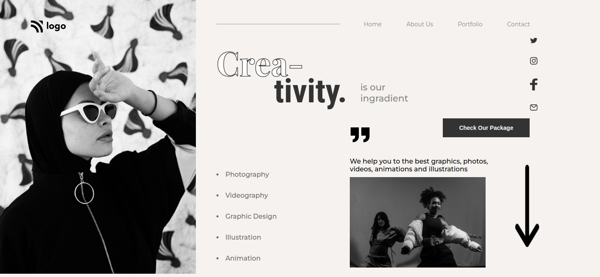

# Assignment 14
13th August 2022
## Full Stack Javascript Web Development Course by [iNeuron](https://ineuron.ai/)

This webpage is created with HTML and CSS only. It is a mobile responsive webpage and I used media query to make it responsive. It took me almost 6 hours to complete this project. This project helped me to learn planning for designing web page, editing svg images. Images and icons are collected from [icons8](https://icons8.com/) and [iNeuron](https://ineuron.ai/).

[Click Here](https://fsjs-assignment14.netlify.app/) to view the website.

## Screenshot of the full web-page:

## Screenshot of full webpage in smaller screen:

## Contact me: [Linkedin](https://www.linkedin.com/in/subham-dutta-8670b8178/) | [Github](https://github.com/Sduttt) | [Twitter](https://twitter.com/Subhamd88404337) | [Facebook](https://www.facebook.com/profile.php?id=100073951804006) | [Instagram](https://www.instagram.com/its_subham_dutta/)

## Find me on [Findcoder.io](https://www.findcoder.io/u/sdutta)